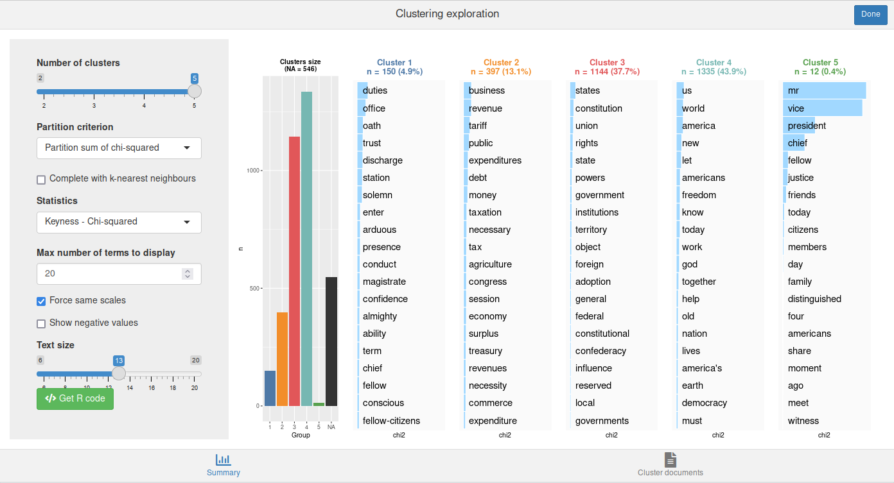

# Rainette  

[](https://cran.r-project.org/package=rainette)

[](https://github.com/juba/rainette/actions?query=workflow%3AR-CMD-check)
<!-- [](https://codecov.io/github/juba/rainette?branch=master) -->


The package website can be found at : [https://juba.github.io/rainette/](https://juba.github.io/rainette/).

Rainette is an R package which implements a variant of the Reinert textual clustering method. This method is available in other software such as [Iramuteq](http://www.iramuteq.org/) (free software) or [Alceste](https://www.image-zafar.com/Logiciel.html) (commercial, closed source).

## Features

- Simple or double clustering algorithms
- Plot functions and shiny gadgets to visualise and explore clustering results
- Utility functions to split a corpus into segments or import a corpus in Iramuteq format

## Installation

The package is installable from CRAN :

```r
install_packages("rainette")
```

The development version is installable from [R-universe](https://r-universe.dev) :

```r
install.packages("rainette", repos = "https://juba.r-universe.dev")
```

## Usage

Let's start with an example corpus provided by the excellent [quanteda](https://quanteda.io) package :

```r
library(quanteda)
data_corpus_inaugural
```

First, we'll use `split_segments` to split each document into segments of about 40 words (punctuation is taken into account) :

```r
corpus <- split_segments(data_corpus_inaugural, segment_size = 40)
```

Next, we'll apply some preprocessing and compute a document-term matrix with `quanteda` functions :

```r
tok <- tokens(corpus, remove_punct = TRUE)
tok <- tokens_remove(tok, stopwords("en"))
dtm <- dfm(tok, tolower = TRUE)
dtm <- dfm_trim(dtm, min_docfreq = 10)
```

We can then apply a simple clustering on this matrix with the `rainette` function. We specify the number of clusters (`k`), and the minimum number of forms in each segment (`min_segment_size`). Segments which do not include enough forms will be merged with the following or previous one when possible.

```r
res <- rainette(dtm, k = 6, min_segment_size = 15)
```

We can use the `rainette_explor` shiny interface to visualise and explore the different clusterings at each `k` :

```r
rainette_explor(res, dtm, corpus)
```


The *Cluster documents* tab allows to browse and filter the documents in each cluster :


We can then use the generated R code to reproduce the displayed clustering visualisation plot :

```r
rainette_plot(res, dtm, k = 5, type = "bar", n_terms = 20, free_scales = FALSE,
    measure = "chi2", show_negative = "TRUE", text_size = 10)
```

Or cut the tree at chosen `k` and add a group membership variable to our corpus metadata :

```r
docvars(corpus)$cluster <- cutree(res, k = 5)
```

In addition to this, we can also perform a double clustering, *ie* two simple clusterings produced with different `min_segment_size` which are then "crossed" to generate more robust clusters. To do this, we use `rainette2` on two `rainette` results :

```r
res1 <- rainette(dtm, k = 5, min_segment_size = 10, min_split_members = 10)
res2 <- rainette(dtm, k = 5, min_segment_size = 15, min_split_members = 10)
res <- rainette2(res1, res2, max_k = 5, min_members = 10)
```

We can then use `rainette2_explor` to explore and visualise the results.

```r
rainette2_explor(res, dtm, corpus)
```



## Tell me more

Three vignettes are available :

- An introduction in english : [Introduction to rainette](https://juba.github.io/rainette/articles/introduction_en.html)
- An introduction in french : [Introduction à rainette](https://juba.github.io/rainette/articles/introduction_usage.html)
- An algorithm description in french : [Description des algorithmes](https://juba.github.io/rainette/articles/algorithmes.html)

## Credits

This classification method has been created by Max Reinert, and is described in several articles. Here are two references :

- Reinert M, Une méthode de classification descendante hiérarchique : application à l'analyse lexicale par contexte, Cahiers de l'analyse des données, Volume 8, Numéro 2, 1983. <http://www.numdam.org/item/?id=CAD_1983__8_2_187_0>
- Reinert M., Alceste une méthodologie d'analyse des données textuelles et une application: Aurelia De Gerard De Nerval, Bulletin de Méthodologie Sociologique, Volume 26, Numéro 1, 1990. <https://doi.org/10.1177/075910639002600103>

Thanks to Pierre Ratineau, the author of [Iramuteq](http://www.iramuteq.org/), for providing it as free software and open source. Even if the R code has been almost entirely rewritten, it has been a precious resource to understand the algorithms.

Many thanks to [Sébastien Rochette](https://github.com/statnmap) for the creation of the hex logo.

Many thanks to [Florian Privé](https://github.com/privefl/) for his work on rewriting and optimizing Rcpp code.
