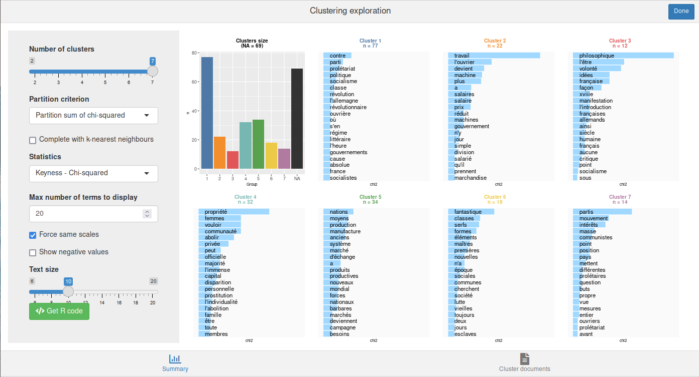

# \[fr\] Utilisation de rainette

Pour une présentation en français des principes de la méthode et de son
utilisation dans `rainette`, vous pouvez aussi consulter la vidéo d’une
intervention réalisée dans le cadre d’[un
tuto](https://mate-shs.cnrs.fr/actions/tutomate/tuto42-rainette-julien-barnier/)
du réseau métier [Mate-shs](https://mate-shs.cnrs.fr/).

## Préparation du corpus

### Importation

La première étape consiste à importer votre corpus dans R. Vous pouvez
utiliser un corpus au format `tm` ou `quanteda`, ou bien utiliser la
fonction `import_corpus_iramuteq` pour importer directement un corpus
depuis un fichier texte [au format
Iramuteq](http://www.iramuteq.org/documentation/formatage-des-corpus-texte).
Dans ce cas vous obtiendrez un objet de type `corpus` du package
[quanteda](https://quanteda.io). Les métadonnées éventuelles présentes
dans le fichier (*variables étoilées*) sont importées en tant que
métadonnées du corpus (variables de `docvars(corpus)`).

Pour ce document, on va importer le texte du *Manifeste du parti
communiste* (Karl Marx et Friedrich Engels, 1848, source
[wikisource](https://fr.wikisource.org/wiki/Manifeste_du_parti_communiste/Lafargue)).
Celui-ci est placé dans un fichier texte au format Iramuteq fourni avec
`rainette`. Le corpus est composé de quatre documents, un document par
partie de l’ouvrage.

``` r
library(rainette)
library(quanteda)

## Import du corpus
fichier <- system.file("extdata", "manifeste_pc.txt", package = "rainette")
corpus <- import_corpus_iramuteq(fichier)
```

On peut vérifier que notre corpus est bien constitué de quatre documents
(l’introduction et les trois parties principales), et d’une variable de
métadonnée :

``` r
corpus
```

    ## Corpus consisting of 4 documents and 1 docvar.
    ## text1 :
    ## "Un spectre hante l’Europe, le spectre du communisme. Toutes ..."
    ## 
    ## text2 :
    ## "L’histoire de toute société jusqu’à nos jours n’a été que l’..."
    ## 
    ## text3 :
    ## "Quelle est la position des communistes vis-à-vis des proléta..."
    ## 
    ## text4 :
    ## "Par leur position historique, les aristocraties françaises e..."

Cette variable de métadonnée est justement la partie correspondant au
texte :

``` r
docvars(corpus)
```

    ##   partie
    ## 1  intro
    ## 2      I
    ## 3     II
    ## 4    III

### Découpage en segments

La méthode Reinert de classification s’applique à des segments de texte
relativement courts, et non à des textes longs. Une première étape
consiste donc à découper chaque texte du corpus en segments via la
fonction
[`split_segments()`](https://juba.github.io/rainette/reference/split_segments.md).
Ici on découpe en segments d’environ 40 mots (l’algorithme essaie de
tenir compte de la ponctuation pour, par exemple, placer les césures
entre des phrases ou au niveau d’une virgule).

``` r
corpus <- split_segments(corpus, segment_size = 40)
```

Notre corpus est désormais constitué de 278 segments et 2 variables de
métadonnées :

``` r
corpus
```

    ## Corpus consisting of 278 documents and 2 docvars.
    ## text1_1 :
    ## "Un spectre hante l’Europe, le spectre du communisme. Toutes ..."
    ## 
    ## text1_2 :
    ## "Quelle est l’opposition qui, à son tour, n’a pas relancé à s..."
    ## 
    ## text1_3 :
    ## "à la face du monde entier, leur manière de voir, leurs buts ..."
    ## 
    ## text2_1 :
    ## "L’histoire de toute société jusqu’à nos jours n’a été que l’..."
    ## 
    ## text2_2 :
    ## "une guerre qui finissait toujours, ou par une transformation..."
    ## 
    ## text2_3 :
    ## "Dans la Rome antique, nous trouvons des patriciens, des chev..."
    ## 
    ## [ reached max_ndoc ... 272 more documents ]

Si on regarde les nouvelles métadonnées, on peut voir que la variable
`partie` a été dupliquée pour chaque segment correspondant, et une
nouvelle variable `segment_source` indique le document d’origine du
segment.

``` r
head(docvars(corpus))
```

    ##   partie segment_source
    ## 1  intro          text1
    ## 2  intro          text1
    ## 3  intro          text1
    ## 4      I          text2
    ## 5      I          text2
    ## 6      I          text2

On peut aussi visualiser les premiers segments de texte calculés :

``` r
as.character(corpus)[1:2]
```

    ##                                                                                                                                                                                                                                                                                                                                                   text1_1 
    ## "Un spectre hante l’Europe, le spectre du communisme. Toutes les puissances de la vieille Europe se sont unies en une Sainte-Alliance pour traquer ce spectre : le Pape et le Czar, Metternich et Guizot, les radicaux de France et les policiers d’Allemagne.\nQuelle est l’opposition que n’ont pas accusée de communisme ses adversaires au pouvoir ?" 
    ##                                                                                                                                                                                                                                                                                                                                                   text1_2 
    ##                       "Quelle est l’opposition qui, à son tour, n’a pas relancé à ses adversaires de droite ou de gauche l’épithète flétrissante de communiste ?\nDeux choses ressortent de ces faits :\n1° Déjà le communisme est reconnu par toutes les puissances d'Europe comme une puissance ;\n2° Il est grand temps que les communistes exposent,"

### Calcul et traitement de la matrice termes-documents

L’étape suivante est de calculer la matrice termes-documents (*dtm*),
grand tableau numérique comportant les documents en lignes, les termes
en colonnes, et comme valeurs le nombre d’occurrences de chaque terme
dans chaque document.

Notre corpus étant au format `quanteda`, on va utiliser les fonctions de
cette extension.

On commence par tokeniser le corpus en supprimant nombre et
ponctuations, on supprime les mots outils les plus courants et on
convertit tous les termes en minuscules, puis on calule la matrice
termes-documents avec la fonction
[`dfm()`](https://quanteda.io/reference/dfm.html).

``` r
tok <- tokens(corpus, remove_punct = TRUE, remove_numbers = TRUE)
tok <- tokens_remove(tok, stopwords("fr"))
tok <- tokens_tolower(tok)
dtm <- dfm(tok)
```

On supprime ensuite de la matrice les termes apparaissant dans moins de
3 segments.

``` r
dtm <- dfm_trim(dtm, min_docfreq = 3)
```

De nombreux autres traitements seraient possibles, mais on se contentera
de cette matrice pour cet exemple.

## Classification simple

Une fois notre matrice calculée, on peut procéder à une première forme
de classification : une classification descendante hiérarchique simple,
calculée avec la fonction
[`rainette()`](https://juba.github.io/rainette/reference/rainette.md).

On peut lui passer plusieurs arguments, notamment :

- `k` : le nombre maximal de classes souhaitées.
- `min_split_members` : le nombre minimal de documents pour qu’une
  classe soit scindée en deux à l’étape suivante de la classification.
- `min_segment_size` : le nombre minimal de termes par segment. En
  effet, lors de la tokenisation et du calcul de la dtm, certaines
  formes (mots-outils, mots trop peu fréquents) ont été supprimées, nos
  segments peuvent donc varier en taille (entendue comme le nombre de
  termes encore présents). Avec `min_segment_size = 10`, les segments
  comportant moins de 10 formes sont regroupés avec le segment suivant
  ou précédent du même document (si possible) jusqu’à atteindre la
  taille minimale souhaitée.

``` r
res <- rainette(dtm, k = 5, min_segment_size = 10, min_split_members = 10)
```

L’objet résultat ne nous dit pas grand chose en lui-même :

``` r
res
```

    ## 
    ## Call:
    ## rainette(dtm = dtm, k = 5, min_segment_size = 10, min_split_members = 10)
    ## 
    ## Cluster method   : reinert 
    ## Number of objects: 5

Pour faciliter l’exploration des résultats, `rainette` propose une
interface interactive qui peut être lancée avec la fonction
[`rainette_explor()`](https://juba.github.io/rainette/reference/rainette_explor.md) :

``` r
rainette_explor(res, dtm, corpus)
```

L’interface devrait ressembler à quelque chose comme ça :


Interface de rainette_explor()

Il est possible de modifier le nombre de classes, la statistique
utilisée dans les graphiques (spécificité, termes les plus fréquents),
etc. Par défaut, les graphiques sous chaque classe indiquent les termes
les plus caractéristiques du groupe positivement (en bleu) ou
négativement (en rouge et si vous avez coché la case *Show negative
values*).

Cette interface vous permet d’expérimenter librement sur le nombre de
classes et leur interprétation.

L’onglet *Cluster documents* permet à tout moment de visualiser les
documents d’une classe. Vous pouvez également filtrer ces documents en
saisissant un mot ou une expression régulière dans le champ *Filter by
term* :


Onglet “Cluster documents” de rainette_explor()

Dans l’onglet *Summary*, vous pouvez également cliquer sur *Get R code*
pour obtenir le code R correspondant au graphique actuellement affiché,
ainsi que la commande `cutree` qui vous permet de récupérer les groupes
d’appartenance de chaque document du corpus, là aussi selon le nombre de
groupes actuellement affichés.

``` r
## Clustering description plot
rainette_plot(res, dtm, k = 5, type = "bar", n_terms = 20, free_scales = FALSE,
    measure = "chi2", show_negative = "TRUE", text_size = 11)
## Groups 
cutree(res, k = 5)
```

Vous pouvez par exemple utiliser l’appel de `cutree` pour ajouter comme
nouvelle métadonnée du corpus le groupe d’appartenance de chaque segment
pour la classification en 5 classes :

``` r
corpus$groupe <- cutree(res, k = 5)
head(docvars(corpus))
```

    ##   partie segment_source groupe
    ## 1  intro          text1      4
    ## 2  intro          text1      4
    ## 3  intro          text1      4
    ## 4      I          text2      5
    ## 5      I          text2      5
    ## 6      I          text2      5

Ici les classes ont attribuées aux segments, et non aux documents dans
leur ensemble. La fonction
[`clusters_by_doc_table()`](https://juba.github.io/rainette/reference/clusters_by_doc_table.md)
permet d’afficher, pour chaque document (ici chacune des quatre parties
du texte), le nombre de segments de chaque groupe :

``` r
clusters_by_doc_table(corpus, clust_var = "groupe")
```

    ## # A tibble: 4 × 6
    ##   doc_id clust_1 clust_2 clust_3 clust_4 clust_5
    ##   <chr>    <int>   <int>   <int>   <int>   <int>
    ## 1 text1        0       0       0       3       0
    ## 2 text2       22      35       5      26      15
    ## 3 text3       44       6       7      11       7
    ## 4 text4        8       5      27      35      22

En ajoutant `prop = TRUE`, cette répartition peut être visualisée en
pourcentages :

``` r
clusters_by_doc_table(corpus, clust_var = "groupe", prop = TRUE)
```

    ## # A tibble: 4 × 6
    ##   doc_id clust_1 clust_2 clust_3 clust_4 clust_5
    ##   <chr>    <dbl>   <dbl>   <dbl>   <dbl>   <dbl>
    ## 1 text1     0       0       0      100      0   
    ## 2 text2    21.4    34.0     4.85    25.2   14.6 
    ## 3 text3    58.7     8       9.33    14.7    9.33
    ## 4 text4     8.25    5.15   27.8     36.1   22.7

À l’inverse,
[`docs_by_cluster_table()`](https://juba.github.io/rainette/reference/docs_by_cluster_table.md)
permet de visualiser, pour chaque groupe, le nombre et la proportion de
documents d’origine comportant au moins un segment de ce groupe :

``` r
docs_by_cluster_table(corpus, clust_var = "groupe")
```

    ## # A tibble: 5 × 3
    ##   cluster     n   `%`
    ##   <chr>   <int> <dbl>
    ## 1 clust_1     3    75
    ## 2 clust_2     3    75
    ## 3 clust_3     3    75
    ## 4 clust_4     4   100
    ## 5 clust_5     3    75

## Classification double

Le deuxième type de classification proposé est une classification
double : selon la méthode proposée par Max Reinert, on effectue deux
classifications simples en faisant varier la taille minimale des
segments, puis on “croise” les résultats de ces deux classifications
pour déterminer de nouvelles classes, potentiellement plus robustes.
Pour plus de détails sur la classifcation double, se référer à la
[vignette de description des
algorithmes](https://juba.github.io/rainette/articles/algorithmes.md).

Une classification double utilise la fonction
[`rainette2()`](https://juba.github.io/rainette/reference/rainette2.md).
On commence par effectuer les deux classifications simples, ici une avec
une taille de segment minimale à 10, et une autre à 15 :

``` r
res1 <- rainette(dtm, k = 7, min_segment_size = 10)
res2 <- rainette(dtm, k = 7, min_segment_size = 15)
```

Puis on utilise
[`rainette2()`](https://juba.github.io/rainette/reference/rainette2.md)
sur ces deux objets résultats, en lui indiquant le nombre maximal de
classes à calculer (argument `max_k`).

``` r
res <- rainette2(res1, res2, max_k = 7)
```

Un paramètre important de
[`rainette2()`](https://juba.github.io/rainette/reference/rainette2.md)
est le paramètre `full` :

- Si `full = TRUE` (valeur par défaut), la sélection des partitions
  optimales de classes croisées se fait en conservant toutes les classes
  croisées non nulles. Ceci permet une recherche “exhaustive” et permet
  de sélectionner les partitions ayant l’effectif total le plus élevé ou
  bien le χ² d’association le plus fort. Les temps de calcul peuvent
  cependant être longs si le nombre de classes de départ est important.
- Si `full = FALSE`, seules les classes croisées dont les deux memebres
  sont les plus associés mutuellement au sens du χ² sont conservées. Les
  calculs sont beaucoup plus rapides, mais le *k* maximal risque d’être
  moins élevé, et seules les partitions avec le χ² d’association le plus
  élevé sont conservées.

À noter que pour `full = TRUE`, si le temps d’exécution est trop long il
est possible d’utiliser également `parallel = TRUE` qui permet de
paralléliser une partie des calculs (attention cette option ne
fonctionne pas sous Windows, et elle utilise davantage de RAM).

Dans tous les cas l’objet résultat contient, pour chaque valeur de `k`,
les partitions optimales trouvées et leurs caractéristiques. Là encore,
une interface interactive est proposée pour visualiser et explorer ces
résultats. Elle se lance via la fonction
[`rainette2_explor()`](https://juba.github.io/rainette/reference/rainette2_explor.md) :

``` r
rainette2_explor(res, dtm, corpus)
```



Interface de rainette2_explor()

L’interface est très semblable à la précédente, sauf qu’il n’y a plus de
dendrogramme mais à la place un diagramme en barre des effectifs des
groupes. Soyez attentifs aux `NA`, qui représentent les segments non
classés : contrairement à la classification simple, ils peuvent ici être
assez nombreux.

Si certains segments n’ont pas été affecté à un groupe, vous pouvez
utiliser
[`rainette2_complete_groups()`](https://juba.github.io/rainette/reference/rainette2_complete_groups.md)
pour les assigner au groupe le plus proche selon une méthode *k-nearest
neighbors* (avec k=1). Ceci n’est cependant pas forcément conseillé car
les classes perdont du coup une partie de la “robustesse” acquise par la
classification double.

``` r
groupes <- cutree(res, k = 5)
groupes_complets <- rainette2_complete_groups(dtm, groupes)
```

## Traitements complémentaires

Dans sa version originale, la méthode Reinert de classification est
souvent suivie par une analyse complémentaire centrée sur les
mots-outils et par différentes représentations graphiques, notamment en
projetant les classes obtenues sur des résultats d’analyses
factorielles.

On trouvera une explication et un exemple d’application, ainsi qu’un
aperçu des fondements théoriques de la méthode dans l’article de Claire
Tissot : [Analyse textuelle du roman « Sarrasine » d’Honoré de Balzac :
de la recherche de thèmes à la
sémiotique](https://clairetissotsemiotique.wordpress.com/2022/05/06/analyse-textuelle-du-roman-sarrasine-dhonore-de-balzac-de-la-recherche-de-themes-a-la-semiotique/).
