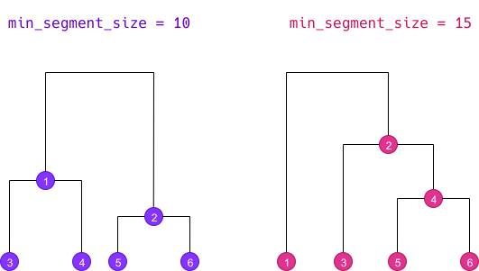
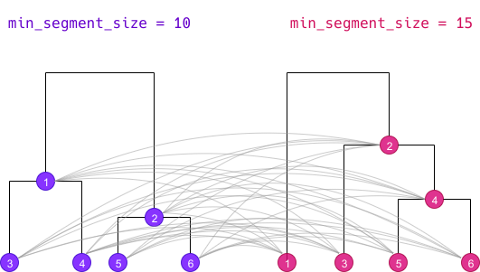

L'objectif de ce document est de décrire les algorithmes utilisés pour les classifications dans `rainette` et leur implémentation. À noter que cette implémentation s'est appuyée sur deux éléments principaux :

- les trois articles de Max Reinert cités dans les [références]
- le code source d'Iramuteq, notamment les fichiers `CHD.R` et `chdtxt.R`. Le code a cependant été quasiment entièrement réécrit, et certaines portions ont été implémentées en C++ via [Rcpp](https://www.rcpp.org/).

## Algorithme de classification simple

### Matrice de départ

La classification simple est une classification descendante hiérarchique (CDH). 

Le tableau de départ est la matrice termes-documents croisant les documents du corpus et les termes qui les composent. Cette matrice est une matrice binaire de présence/absence du terme dans le document, et non une matrice d'occurrences. 

On a donc un tableau de ce type :

```{r echo=FALSE}
set.seed(1337)
m <- matrix(sample(0:1, 20, replace = TRUE), nrow = 4)
rownames(m) <- paste0("doc", 1:4)
colnames(m) <- c("partir", "un", "jour", "sans", "retour")
m
```

À noter que si les documents sont des segments obtenus avec `split_segments()`, les segments trop courts d'un même document peuvent être regroupés entre eux au moment de la classification pour atteindre la taille minimale indiquée par l'argument `min_segment_size` de `rainette()`.

### Division maximisant le Khi2

On souhaite diviser cette matrice termes-documents en deux groupes de documents aussi "différents" que possible. La méthode Reinert consiste à sélectionner le regroupement qui maximise la statistique du χ² du tableau regroupé.

Par exemple, dans le tableau ci-dessus, si on regroupe `doc1` avec `doc2` et `doc3` avec `doc4`, on obtient le tableau suivant :

```{r echo=FALSE}
tmp <- rbind(colSums(m[1:2,]), colSums(m[3:4,]))
rownames(tmp) <- c("doc1 + doc2", "doc3 + doc4")
tmp
```

On peut calculer la valeur du χ² de ce tableau. Cette statistique est un indicateur de la "distance" entre les deux groupes de documents en ce qui concerne la distribution des termes : plus la valeur du χ² du tableau regroupé est élevée et plus les deux groupes sont différents, plus elle est faible et plus ils se ressemblent.

Dans un cas aussi simple, on peut effectuer tous les regroupements de documents possibles et déterminer lequel correspond au χ² maximal, mais avec des données réelles la complexité augmente trop rapidement.

On opère donc de la manière suivante :

- on effectue une analyse factorielle des correspondances de la matrice termes-documents, et on ordonne les documents selon leur coordonnée sur le premier axe de cette AFC.
- on regroupe tour à tour les documents entre eux selon cet ordonnancement : d'abord le point avec la coordonnée la plus basse *vs* tous les autres, puis les deux points avec les coordonnées les plus basses *vs* tous les autres, etc. On calcule à chaque fois le χ² correspondant et on conserve au final le regroupement qui le maximise.
- à partir de ce regroupement, on effectue une réaffectation des documents : on change tour à tour chaque document de classe, et on regarde si cela fait augmenter le χ². Si c'est le cas on conserve cette nouvelle affectation.
- on recommence cette opération de réaffectation jusqu'à ce qu'elle ne permette plus d'augmenter la valeur du χ².

On obtient donc au final deux groupes de documents et deux matrices termes-documents correspondantes.

### Sélection des termes

L'étape suivante consiste en une sélection des termes dans chacun des deux tableaux pour les prochaines itérations :

- on regarde la fréquence de chaque terme, et on supprime les termes qui apparaissent moins de 3 fois (cette valeur est modifiable via l'argument `tsj` de `rainette()`). 
- on compare également l'effectif observé de chaque terme avec l'effectif attendu sous l'hypothèse d'indépendance de la répartition du terme entre les deux groupes, et on en déduit un coefficient de contingence pour ce terme. Si ce coefficient de contingence est supérieur à 0.3, on ne conserve le terme que dans le tableau dans lequel il est surreprésenté (le seuil de 0.3 est modifiable via l'argument `cc_test` de `rainette()`).


### Classification descendante hiérarchique

Les étapes précédentes permettent de scinder un corpus en deux groupes. Pour obtenir une hiérarchie de classes, on commence par scinder le corpus entier, puis on recommence de la même manière avec le groupe obtenu comportant le plus de documents (sauf si le tableau en question est trop petit pour calculer une AFC, ou si son effectif est inférieur à l'argument `min_split_members` de `rainette()`).

En procédant de cette manière `k - 1` fois, on obtient une classification descendante hiérarchique (CDH) en `k` groupes, et le dendrogramme correspondant (la hauteur des branches du dendrogramme étant la valeur maximale du χ² trouvée au moment du split).


## Algorithme de classification double

La classification double s'applique à un corpus découpé en segments. L'objectif est d'obtenir des classes plus robustes en croisant les résultats de deux classifications simples calculées avec des tailles minimales de segments différentes.

La classification double consiste donc à effectuer deux classifications simples avec des valeurs distinctes de `min_segment_size`. On obtient donc deux dendrogrammes différents qui déterminent des classes ici numérotées de 1 à 6 :



### Calcul des classes croisées

La première étape consiste à croiser les classes des deux CDH :



On prend chaque classe de la première CDH, et on la croise avec chaque classe de la seconde (y compris si les classes ne sont pas de même niveau `k`). On appelle la nouvelle classe obtenue une "classe croisée" :

- pour chaque classe croisée, on calcule l'effectif du croisement, c'est à dire le nombre de documents présents dans les deux classes.
- à partir de cet effectif, de l'effectif de chaque classe et du nombre total de documents, on peut créer un tableau croisé d'appartenance aux deux classes : on calcule alors le χ² de ce tableau, qui représente une mesure de "l'association" entre les deux classes.
- si deux classes croisées différentes comportent les mêmes documents, on ne conserve que l'une d'entre elles.
- si une classe croisée comporte un effectif inférieur à la valeur de l'argument `min_members` de `rainette2()`, elle n'est pas conservée.
- si une classe croisée comporte un χ² d'association inférieur à la valeur de l'argument `min_chi2` de `rainette2()`, elle n'est pas conservée.

<table>
  <thead>
    <tr>
      <th align="center">Classe croisée</th>
      <th align="right">Effectif</th>
      <th align="right">χ² d'association</th>
    </tr>
  </thead>
  <tbody>
    <tr><td align="center"><span class="cross"><span>1</span><span>1</span></span></td><td align="right">25</td><td align="right">41.2</td></tr>
    <tr><td align="center"><span class="cross"><span>1</span><span>2</span></span></td><td align="right">102</td><td align="right">30.1</td></tr>
    <tr><td align="center"><span class="cross"><span>1</span><span>3</span></span></td><td align="right">59</td><td align="right">87.3</td></tr>
    <tr><td align="center"><span class="cross"><span>1</span><span>4</span></span></td><td align="right">41</td><td align="right">94.0</td></tr>
    <tr><td align="center"><span class="cross"><span>1</span><span>5</span></span></td><td align="right">0</td><td align="right">-</td></tr>
    <tr><td align="center"><span class="cross"><span>1</span><span>6</span></span></td><td align="right">13</td><td align="right">6.2</td></tr>
    <tr><td align="center"><span class="cross"><span>2</span><span>1</span></span></td><td align="right">0</td><td align="right">-</td></tr>
    <tr><td align="center">...</td><td align="right">...</td><td align="right">...</td></tr>
    <tr><td align="center"><span class="cross"><span>6</span><span>6</span></span></td><td align="right">5</td><td align="right">3.1</td></tr>
    
  </tbody>
</table>

Une fois ces classes croisées définies, deux type d'analyse sont possibles.

#### Analyse "full"

La première, dite analyse "full" (argument `full = TRUE` de `rainette2()`), conserve pour la suite toutes les classes croisées dont l'effectif est supérieur à zéro (si celles-ci n'ont pas déjà été filtrées à l'étape précédente). Dans l'exemple ci-dessus, on conserverait donc :

<table>
  <thead>
    <tr>
      <th align="center">Classe croisée</th>
      <th align="right">Effectif</th>
      <th align="right">χ² d'association</th>
    </tr>
  </thead>
  <tbody>
    <tr><td align="center"><span class="cross"><span>1</span><span>1</span></span></td><td align="right">25</td><td align="right">41.2</td></tr>
    <tr><td align="center"><span class="cross"><span>1</span><span>2</span></span></td><td align="right">102</td><td align="right">30.1</td></tr>
    <tr><td align="center"><span class="cross"><span>1</span><span>3</span></span></td><td align="right">59</td><td align="right">87.3</td></tr>
    <tr><td align="center"><span class="cross"><span>1</span><span>4</span></span></td><td align="right">41</td><td align="right">94.0</td></tr>
    <tr><td align="center"><span class="cross"><span>1</span><span>6</span></span></td><td align="right">13</td><td align="right">6.2</td></tr>
    <tr><td align="center">...</td><td align="right">...</td><td align="right">...</td></tr>
    <tr><td align="center"><span class="cross"><span>6</span><span>6</span></span></td><td align="right">5</td><td align="right">3.1</td></tr>
    
  </tbody>
</table>

#### Analyse "classique"

La seconde, dite analyse "classique" (argument `full = FALSE` de `rainette2()`) ne conserve une classes croisée que si les deux groupes croisés sont mutuellement les plus associés. Ainsi, si on considère la classe croisée issue du croisement du groupe *x* et du groupe *y*, on ne conserve cette classe que si *y* est le groupe ayant le χ² d'association maximal avec *x*, et si en même temps *x* est le groupe ayant le χ² d'association maximal avec *y*.

Dans ce cas le nombre de classes croisées considérées est beaucoup plus réduit :

<table>
  <thead>
    <tr>
      <th align="center">Classe croisée</th>
      <th align="right">Effectif</th>
      <th align="right">χ² d'association</th>
    </tr>
  </thead>
  <tbody>
    <tr><td align="center"><span class="cross"><span>1</span><span>4</span></span></td><td align="right">41</td><td align="right">94.0</td></tr>
    <tr><td align="center"><span class="cross"><span>3</span><span>3</span></span></td><td align="right">18</td><td align="right">70.1</td></tr>
    <tr><td align="center"><span class="cross"><span>4</span><span>6</span></span></td><td align="right">21</td><td align="right">58.2</td></tr>
    <tr><td align="center"><span class="cross"><span>6</span><span>5</span></span></td><td align="right">25</td><td align="right">61.0</td></tr>
  </tbody>
</table>


### Calcul et sélection des partitions optimales

L'étape suivante consiste à déterminer, à partir des classes croisées calculées précédemment, toutes les partitions possibles de nos documents en 2, 3, 4... classes croisées. Plus précisément, on essaie de déterminer tous les groupes de 2, 3, 4... classes croisées qui n'ont aucun élément en commun.

On commence par déterminer les partitions de taille 2, c'est-à-dire tous les ensembles de deux classes croisées n'ayant aucun élément commun. On calcule pour chaque partition son effectif total et la somme de ses χ² d'association.

<table>
  <thead>
    <tr>
      <th align="center">Partition</th>
      <th align="right">Effectif total</th>
      <th align="right">Somme des χ² d'association</th>
    </tr>
  </thead>
  <tbody>
    <tr>
      <td align="center">
        <span class="cross"><span>1</span><span>1</span></span>
        <span class="cross"><span>2</span><span>3</span></span>
      </td>
      <td align="right">47</td>
      <td align="right">62.3</td>
    </tr>
    <tr>
      <td align="center">
        <span class="cross"><span>1</span><span>4</span></span>
        <span class="cross"><span>3</span><span>5</span></span>
      </td>
      <td align="right">36</td>
      <td align="right">51.0</td>
    </tr>
    <tr>
      <td align="center">
        <span class="cross"><span>2</span><span>4</span></span>
        <span class="cross"><span>1</span><span>6</span></span>
      </td>
      <td align="right">29</td>
      <td align="right">38.2</td>
    </tr>
    <tr>
      <td align="center">
        <span class="cross"><span>1</span><span>2</span></span>
        <span class="cross"><span>5</span><span>3</span></span>
      </td>
      <td align="right">143</td>
      <td align="right">68.7</td>
    </tr>
    <tr><td align="center">...</td><td align="right">...</td><td align="right">...</td></tr>
  </tbody>
</table>

On sélectionne parmi ces partitions celles qui sont considérées comme les "meilleures", c'est-à-dire :

- si on fait une analyse "full" (`full = TRUE`), on sélectionne celle ayant la somme de χ² d'association la plus forte, et celle ayant l'effectif total le plus élevé. 
- si on fait une analyse "classique" (`full = FALSE`), on sélectionne uniquement celle ayant la somme de χ² d'association la plus forte (on ne peut pas utiliser l'effectif total comme critère de sélection dans ce cas-là).

<table>
  <thead>
    <tr>
      <th align="center">Partition</th>
      <th align="right">Effectif total</th>
      <th align="right">Somme des χ² d'association</th>
    </tr>
  </thead>
  <tbody>
    <tr>
      <td align="center">
        <span class="cross"><span>1</span><span>2</span></span>
        <span class="cross"><span>5</span><span>3</span></span>
      </td>
      <td align="right">143</td>
      <td align="right">68.7</td>
    </tr>
    <tr>
      <td align="center">
        <span class="cross"><span>3</span><span>4</span></span>
        <span class="cross"><span>2</span><span>6</span></span>
      </td>
      <td align="right">86</td>
      <td align="right">98.0</td>
    </tr>
  </tbody>
</table>

On fait de même pour les partitions de taille 3 : on détermine les différentes partitions possibles et on conserve les meilleures.

<table>
  <thead>
    <tr>
      <th align="center" style="width: 50%;">Partition</th>
      <th align="right">Effectif total</th>
      <th align="right">Somme des χ² d'association</th>
    </tr>
  </thead>
  <tbody>
    <tr>
      <td align="center">
        <span class="cross"><span>1</span><span>2</span></span>
        <span class="cross"><span>5</span><span>3</span></span>
        <span class="cross"><span>2</span><span>5</span></span>        
      </td>
      <td align="right">189</td>
      <td align="right">91.3</td>
    </tr>
    <tr>
      <td align="center">
        <span class="cross"><span>3</span><span>4</span></span>
        <span class="cross"><span>2</span><span>6</span></span>
        <span class="cross"><span>5</span><span>3</span></span>
      </td>
      <td align="right">113</td>
      <td align="right">108.1</td>
    </tr>
  </tbody>
</table>

Et on continue pour les partitions de 4 classes croisées, etc.

<table style="margin-top: 2em;">
  <thead>
    <tr>
      <th align="center" style="width: 50%;">Partition</th>
      <th align="right">Effectif total</th>
      <th align="right">Somme des χ² d'association</th>
    </tr>
  </thead>
  <tbody>
    <tr>
      <td align="center">
        <span class="cross"><span>3</span><span>4</span></span><span class="cross"><span>2</span><span>6</span></span><span class="cross"><span>5</span><span>3</span></span><span class="cross"><span>1</span><span>5</span></span>        
      </td>
      <td align="right">223</td>
      <td align="right">114.7</td>
    </tr>
  </tbody>
</table>

On répète l'opération jusqu'à atteindre la valeur de l'argument `max_k` de `rainette2()`, ou bien lorsqu'il n'y a aucune partition possible au niveau considéré.

### Résultat

On obtient donc au final, pour chaque valeur de `k` de 2 à `max_k`, une sélection de partitions de classes croisées considérées comme "optimales", soit selon le critère de la somme de leur χ² d'association, soit selon celui de leur effectif total. Ces classes croisées constituent de nouveaux groupes potentiellement plus "robustes" que ceux mis en évidence par les deux CDH simples.

À noter que cette opération peut faire qu'un grand nombre de documents n'appartiennent à aucun des nouveaux groupes. `rainette` propose de réaffecter ces documents aux nouveaux groupes via une méthode rapide de type *k-nearest neighbours*, mais ceci n'est pas forcément conseillé dans la mesure où on perdrait la "robustesse" qui est justement l'objectif de la double classification.


## Différences avec Iramuteq

### Classification simple

L'implémentation de l'algorithme dans `rainette` se différencie de celle d'Iramuteq surtout dans la gestion du paramètre `min_split_members` (le nombre minimal de documents dans une classe).

Dans `rainette`, `min_split_members` est uniquement utilisé au moment du choix du tableau suivant à splitter : si aucun tableau n'a un effectif supérieur à ce paramètre, l'algorithme s'arrête même si on n'a pas atteint la valeur souhaitée de `k`.

Dans Iramuteq, l'algorithme se répète `k` fois dans tous les cas, et il procède à la fin à un regroupement des classes dont l'effectif est inférieur à l'effectif minimal souhaité. Ce regroupement s'effectue en fusionnant ces classes en "remontant" le dendrogramme.

L'avantage de l'implémentation dans `rainette` est qu'on ne "casse" pas la logique du dendrogramme, et qu'on obtient donc comme résultat un arbre complet, qu'on peut couper à la hauteur souhaitée : on peut donc explorer la classification en 2, 3 ... `k` groupes. L'inconvénient est qu'on n'a pas d'assurance de n'avoir aucune classe avec un effectif inférieur à `min_split_members` : on doit procéder à des regroupements manuels si nécessaire.

### Classification double

La méthode proposée par Iramuteq correspond plutôt à la méthode "full" de ce document : après avoir déterminé les classes croisées, on conserve toutes celles ayant un effectif et une valeur de χ² d'association suffisants.

L'algorithme reste très proche de celui d'Iramuteq jusqu'à l'étape de la sélection de partition optimale. Ici on procède à une recherche exhaustive des partitions à partir des classes croisées sélectionnées (ce qui peut occasionner des calculs potentiellement très longs si `min_members` est faible et `max_k` élevé), tandis qu'Iramuteq procède autrement. 

Au niveau des résultats, Iramuteq ne renvoie qu'une seule partition qu'il juge optimale, tandis que `rainette` retourne pour chaque valeur de `k` les meilleures partitions selon les critères de la taille ou du χ² maximum.


## Différences avec la "méthode Reinert"

Le mode de détermination des partitions optimales ne nous a pas semblé très détaillé dans les articles cités en [références], il ne nous est donc pas vraiment possible de comparer avec l'implémentation de `rainette`. A priori la méthode présentée par Max Reinert correspond à la méthode dite "classique" présentée dans ce document : après le calcul des classes croisées on ne conserve que celles dont les deux groupes croisés sont les plus associés mutuellement.

Une différence importante réside dans le fait que dans les articles cités, une fois la partition optimale déterminée, celle-ci est utilisée comme point de départ pour une affectation des documents aux classes via une méthode de type "nuées dynamiques". Ceci permet notamment de réaffecter des points qui ne feraient pas partie des classes croisées de la partition retenue.

Cette réaffectation par centre mobile n'est pas implémentée dans `rainette` (et elle ne semble pas l'être non plus dans Iramuteq). Il faut donc être vigilant au nombre et à la proportion de documents non affectés (valeur de classe à `NA`) à l'issue d'une classification double, car celui-ci peut être élevé. Une fonction `rainette2_complete_groups()` est disponible pour rattacher les points non affectés à une des classes via une méthode du type _k-nearest neighbours_, mais son utilisation n'est pas forcément conseillée.


## Références

- Reinert M., "Une méthode de classification descendante hiérarchique : application à l'analyse lexicale par contexte", *Cahiers de l'analyse des données*, Volume 8, Numéro 2, 1983. <http://www.numdam.org/item/?id=CAD_1983__8_2_187_0>
- Reinert M., "Alceste une méthodologie d'analyse des données textuelles et une application: Aurelia De Gerard De Nerval", *Bulletin de Méthodologie Sociologique*, Volume 26, Numéro 1, 1990. <https://doi.org/10.1177/075910639002600103>
- Reinert M., "Une méthode de classification des énoncés d’un corpus présentée à l’aide d’une application", *Les cahiers de l’analyse des données*, Tome 15, Numéro 1, 1990. <http://www.numdam.org/item/?id=CAD_1990__15_1_21_0>
