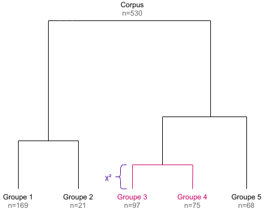

The goal of this document is to describe the algorithms used in the `rainette` package and their implementation. This implementation has been based upon two main resources :

- the three papers from Max Reinert cited in [references] (in french)
- the source code of [Iramuteq](http://www.iramuteq.org/), especially the `CHD.R` and `chdtxt.R` files. Note however that the code has been almost entirely rewritten (in part in C++ via [Rcpp](https://www.rcpp.org/)).


## Simple clustering algorithm

### Document-term matrix

The simple clustering method is a divisive hierarchical clustering applied to a document-term matrix. This matrix is binary weighted, so only the absence or presence of a term in a document is taken into account. 

Here is a sample matrix :

```{r echo=FALSE}
set.seed(13)
m <- matrix(sample(0:1, 20, replace = TRUE), nrow = 4)
rownames(m) <- paste0("doc", 1:4)
colnames(m) <- c("return", "of", "the", "obra", "dinn")
m
```

Note that if documents are segments computed by `split_segments()`, segments from the same source may be merged together before clustering computation if some of them are too short and don't reach the minimum size given by the `min_segment_size` argument of `rainette()`.

### Maximal χ² splitting

In the newt step, the goal is to split the document-term matrix into two groups of documents such as these are as "different" as possible. For the Reinert method, the "best" split is the one which maximizes the χ² value of the grouped array.

For example, using the previous matrix, if we group together `doc1` with `doc2` and `doc3` with `doc4`, we get the following grouped array :

```{r echo=FALSE}
tmp <- rbind(colSums(m[1:2,]), colSums(m[3:4,]))
rownames(tmp) <- c("doc1 + doc2", "doc3 + doc4")
tmp
```

We can compute the χ² statistics of this array, which can be seen has an association coefficient between the two document groups regarding their term distributions : if the χ² is high, the two groups are different, if it is low they can be considered as similar.

In such a simple case, we could compute every possible groupings and determine which one corresponds to the maximal χ² value, but with real data the complexity and needed computations rise very rapidly.

The Reinert method therefore proceeds the following way :

- we first compute a correspondance analysis on the document-term matrix, and we sort the documents along their coordinate on the first axis.
- we group documents together successively following this ordering : first the lowest coordinate document *vs* all the others, then the two lowest ones *vs* all the others, and so on. Each time we compute the χ² value of the grouped matrix, and we keep the grouping which corresponds to the highest χ² value.
- based on this grouping, we succesively assign each document to the other group, and see if this makes the χ² rise. If it is the case, the document is kept in the other group. This operation is repeated until no reassignment makes the χ² higher.

At the end we get two groups of documents and two corresponding document-term matrices.

### Terms selection

The following step is to filter out some terms from each matrices before the next iteration :

- we compute each term frequency in both matrices, and remove terms with a frequency lower than 3 (this value can be changed using the `tsj` argument of `rainette()`).
- we also compare the observed frequency of each term and their expected frequency under independance hypothesis of distribution between the two groups. This allows to compute a contingency coefficient : if this coefficient is higher than 0.3, the term is only kept in the matrix where it is overrepresented (the 0.3 threshold can be changed using the `cc_test` argument of `rainette()`).

### Divisive hierarchical clustering

The previous steps allow to split a documents corpus into two groups. To get a hierarchy of groups, we first split the whole initial corpus, then continue by splitting the biggest resulting cluster, *ie* the one with the most documents (unless the cluster document-term matrix is too small to compute a correspondance analysis, or if its size is smaller than the value of the `min_split_members` argument of `rainette()`).

By repeating this `k - 1` times, we get a divisive hierarchical clustering of `k` clusters, and the corresponding dendrogram (the height of each dendrogram branch is given by the χ² value of the corresponding split).




## Double clustering algorithm

The double clustering only applies to a corpus which has been split into segments. The goal is to make clusters more robust by crossing the results of two single clusterings computed with different minimal segment sizes.

Doing a double clustering implies therefore implies that we first do two simple clusterings with distinct `min_segment_size` values. We then get two different dendrograms determining different clusters, here numbered from 1 to 6 :


### Cross-clusters computation

The first step of the algorithm is to cross all clusters from both dendrograms together :


Each cluster of the first simple clustering is crossed with each cluster of the second one, even if both cluster do not belong to the same `k` level. The new resulting cluster is called a "crossed cluster" :

- for each crossed cluster, we compute its size, *ie* the number of segments belonging to both clusters.
- using this size, the size of both clusters and the total number of segments, we can create a cross table of clusters membership : we compute the χ² value of this table, which can be seen as an "association coefficient" between the two clusters.
- if two different crossed clusters hold exactly the same segments, we only keep one.
- if a crossed cluster size is lower than the value of the `min_members` argument of `rainette2()`, it is discarded.
- if a crossed cluster has an association χ² lower than the value of the `min_chi2` argument of `rainette2()`, it is discarded.

<table>
  <thead>
    <tr>
      <th align="center">Crossed cluster</th>
      <th align="right">Size</th>
      <th align="right">Association χ²</th>
    </tr>
  </thead>
  <tbody>
    <tr><td align="center"><span class="cross"><span>1</span><span>1</span></span></td><td align="right">25</td><td align="right">41.2</td></tr>
    <tr><td align="center"><span class="cross"><span>1</span><span>2</span></span></td><td align="right">102</td><td align="right">30.1</td></tr>
    <tr><td align="center"><span class="cross"><span>1</span><span>3</span></span></td><td align="right">59</td><td align="right">87.3</td></tr>
    <tr><td align="center"><span class="cross"><span>1</span><span>4</span></span></td><td align="right">41</td><td align="right">94.0</td></tr>
    <tr><td align="center"><span class="cross"><span>1</span><span>5</span></span></td><td align="right">0</td><td align="right">-</td></tr>
    <tr><td align="center"><span class="cross"><span>1</span><span>6</span></span></td><td align="right">13</td><td align="right">6.2</td></tr>
    <tr><td align="center"><span class="cross"><span>2</span><span>1</span></span></td><td align="right">0</td><td align="right">-</td></tr>
    <tr><td align="center">...</td><td align="right">...</td><td align="right">...</td></tr>
    <tr><td align="center"><span class="cross"><span>6</span><span>6</span></span></td><td align="right">5</td><td align="right">3.1</td></tr>
    
  </tbody>
</table>

Once these crossed clusters have been computed, two types of analysis are possible.

#### "full" analysis

The first type, called a "full" analysis (`full = TRUE` argument of `rainette2()`), retains for the following steps all the crossed clusters with a size greater than zero (if these have not already been filtered out at the previous step). In the previous example, we would keep :

<table>
  <thead>
    <tr>
      <th align="center">Crossed cluster</th>
      <th align="right">Size</th>
      <th align="right">Association χ²</th>
    </tr>
  </thead>
  <tbody>
    <tr><td align="center"><span class="cross"><span>1</span><span>1</span></span></td><td align="right">25</td><td align="right">41.2</td></tr>
    <tr><td align="center"><span class="cross"><span>1</span><span>2</span></span></td><td align="right">102</td><td align="right">30.1</td></tr>
    <tr><td align="center"><span class="cross"><span>1</span><span>3</span></span></td><td align="right">59</td><td align="right">87.3</td></tr>
    <tr><td align="center"><span class="cross"><span>1</span><span>4</span></span></td><td align="right">41</td><td align="right">94.0</td></tr>
    <tr><td align="center"><span class="cross"><span>1</span><span>6</span></span></td><td align="right">13</td><td align="right">6.2</td></tr>
    <tr><td align="center">...</td><td align="right">...</td><td align="right">...</td></tr>
    <tr><td align="center"><span class="cross"><span>6</span><span>6</span></span></td><td align="right">5</td><td align="right">3.1</td></tr>
    
  </tbody>
</table>

#### "classical" analysis

The second type, called a "classical" analysis (`full = FALSE` argument of `rainette2()`), only keeps for the following steps the crossed clusters whose clusters are mutually most associated. Thus, if we consider the crossed cluster crossing cluster *x* and cluster *y*, we only keep this crossed cluster if *y* is the cluster with the highest association χ² with *x*, and if at the same time *x* is the cluster with the highest association χ² with *y*.

In this case the number of crossed clusters kept for the following steps is much lower :

<table>
  <thead>
    <tr>
      <th align="center">Crossed cluster</th>
      <th align="right">Size</th>
      <th align="right">Association χ²</th>
    </tr>
  </thead>
  <tbody>
    <tr><td align="center"><span class="cross"><span>1</span><span>4</span></span></td><td align="right">41</td><td align="right">94.0</td></tr>
    <tr><td align="center"><span class="cross"><span>3</span><span>3</span></span></td><td align="right">18</td><td align="right">70.1</td></tr>
    <tr><td align="center"><span class="cross"><span>4</span><span>6</span></span></td><td align="right">21</td><td align="right">58.2</td></tr>
    <tr><td align="center"><span class="cross"><span>6</span><span>5</span></span></td><td align="right">25</td><td align="right">61.0</td></tr>
  </tbody>
</table>


### Determining optimal partitions

The goal of the next step is to identify, starting from the set of crossed clusters defined previously, every possible partitions of our corpus in 2, 3, 4... crossed clusters. More precisely, we try to identify each set of 2, 3, 4... crossed clusters which have no common elements.

We start by computing the size 2 partitions, *ie* every set of 2 crossed clusters without common elements. For each partition we compute is total size and the sum of its association χ².

<table>
  <thead>
    <tr>
      <th align="center">Partition</th>
      <th align="right">Total size</th>
      <th align="right">Sum of association χ²</th>
    </tr>
  </thead>
  <tbody>
    <tr>
      <td align="center">
        <span class="cross"><span>1</span><span>1</span></span>
        <span class="cross"><span>2</span><span>3</span></span>
      </td>
      <td align="right">47</td>
      <td align="right">62.3</td>
    </tr>
    <tr>
      <td align="center">
        <span class="cross"><span>1</span><span>4</span></span>
        <span class="cross"><span>3</span><span>5</span></span>
      </td>
      <td align="right">36</td>
      <td align="right">51.0</td>
    </tr>
    <tr>
      <td align="center">
        <span class="cross"><span>2</span><span>4</span></span>
        <span class="cross"><span>1</span><span>6</span></span>
      </td>
      <td align="right">29</td>
      <td align="right">38.2</td>
    </tr>
    <tr>
      <td align="center">
        <span class="cross"><span>1</span><span>2</span></span>
        <span class="cross"><span>5</span><span>3</span></span>
      </td>
      <td align="right">143</td>
      <td align="right">68.7</td>
    </tr>
    <tr><td align="center">...</td><td align="right">...</td><td align="right">...</td></tr>
  </tbody>
</table>

We only keep among these partitions the ones that are considered the "best" ones :

- if we are doing a "full" analysis (`full = TRUE`), we keep the one having the highest sum of χ², and the one with the highest total size.
- if we are doing a "classical" analysis (`full = FALSE`), we only keep the one with the highest sum of χ² (we can use the highest total size criterion in this case).

<table>
  <thead>
    <tr>
      <th align="center">Partition</th>
      <th align="right">Total size</th>
      <th align="right">Sum of association χ²</th>
    </tr>
  </thead>
  <tbody>
    <tr>
      <td align="center">
        <span class="cross"><span>1</span><span>2</span></span>
        <span class="cross"><span>5</span><span>3</span></span>
      </td>
      <td align="right">143</td>
      <td align="right">68.7</td>
    </tr>
    <tr>
      <td align="center">
        <span class="cross"><span>3</span><span>4</span></span>
        <span class="cross"><span>2</span><span>6</span></span>
      </td>
      <td align="right">86</td>
      <td align="right">98.0</td>
    </tr>
  </tbody>
</table>

We do the same for the size 3 partitions : we identify every set of 3 non overlapping crossed clusters, and keep the "best" ones.

<table>
  <thead>
    <tr>
      <th align="center" style="width: 50%;">Partition</th>
      <th align="right">Total size</th>
      <th align="right">Sum of association χ²</th>
    </tr>
  </thead>
  <tbody>
    <tr>
      <td align="center">
        <span class="cross"><span>1</span><span>2</span></span>
        <span class="cross"><span>5</span><span>3</span></span>
        <span class="cross"><span>2</span><span>5</span></span>        
      </td>
      <td align="right">189</td>
      <td align="right">91.3</td>
    </tr>
    <tr>
      <td align="center">
        <span class="cross"><span>3</span><span>4</span></span>
        <span class="cross"><span>2</span><span>6</span></span>
        <span class="cross"><span>5</span><span>3</span></span>
      </td>
      <td align="right">113</td>
      <td align="right">108.1</td>
    </tr>
  </tbody>
</table>

And we repeat the operation for 4 crossed clusters, etc.

<table style="margin-top: 2em;">
  <thead>
    <tr>
      <th align="center" style="width: 50%;">Partition</th>
      <th align="right">Total size</th>
      <th align="right">Sum of association χ²</th>
    </tr>
  </thead>
  <tbody>
    <tr>
      <td align="center">
        <span class="cross"><span>3</span><span>4</span></span><span class="cross"><span>2</span><span>6</span></span><span class="cross"><span>5</span><span>3</span></span><span class="cross"><span>1</span><span>5</span></span>        
      </td>
      <td align="right">223</td>
      <td align="right">114.7</td>
    </tr>
  </tbody>
</table>

The operation is repeated until we reach the value of the `max_k` argument passed to `rainette2()`, or until there is no possible partition of the size `k`.


### Result

At the end we get, for each `k` value from 2 to `max_k`, a selection of the "best" crossed clusters partitions, either according to the association χ² criterion or according to the total size criterion. These crossed clusters form a new set of clusters which are potentially more "robust" than the ones computed from the two simple clusterings.

After this operation, a potentially high number of segments may not belong to any cluster anymore. `rainette` allows to reassign them to the new clusters with a fast *k-nearest neighbours* method, but this may not be recommended as we would then loose the clusters robustness acquired with the double clustering. 


## Differences with the "Reinert method"

The way to determine the optimal partitions did not seem completely clear to us in the articles cited in [references], so it is not really possible to compare with the `rainette` implementation. The "classical" method described in this document seems to be close from the one suggested by Max Reinert : after computing the crossed clusters, we only keep the ones where the two crossed clusters are both the most mutually associated.

One important difference is the fact that once the best partition of crossed clusters has been determined, Max Reinert suggests to use these new groups as starting points to reassign the documents to new clusters with a k-means type method. This is not implemented in `rainette` : the `rainette2_complete_groups()` allows to reassign documents without cluster using a *k-nearest neighbours* method, but this may not be recommended if you want to keep the "robustness" of the clusters computed with the double clustering.


## References

- Reinert M., "Une méthode de classification descendante hiérarchique : application à l'analyse lexicale par contexte", *Cahiers de l'analyse des données*, Volume 8, Numéro 2, 1983. <http://www.numdam.org/item/?id=CAD_1983__8_2_187_0>
- Reinert M., "Alceste une méthodologie d'analyse des données textuelles et une application: Aurelia De Gerard De Nerval", *Bulletin de Méthodologie Sociologique*, Volume 26, Numéro 1, 1990. <https://doi.org/10.1177/075910639002600103>
- Reinert M., "Une méthode de classification des énoncés d’un corpus présentée à l’aide d’une application", *Les cahiers de l’analyse des données*, Tome 15, Numéro 1, 1990. <http://www.numdam.org/item/?id=CAD_1990__15_1_21_0>
