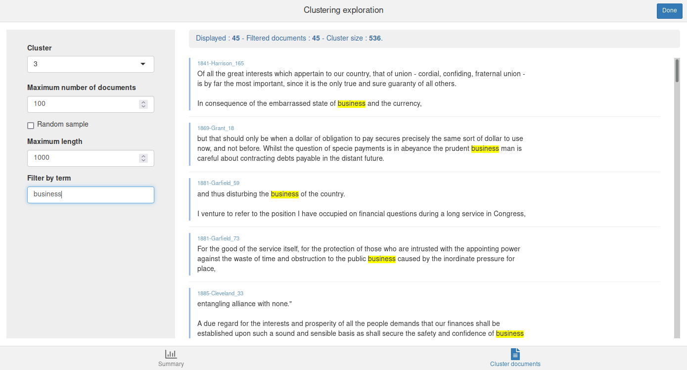
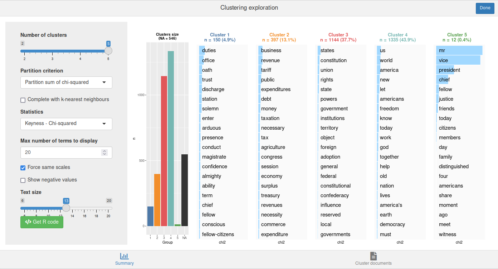

```{r setup, include=FALSE}
knitr::opts_chunk$set(echo = TRUE)
```

## Corpus preparation

For a description of the Reinert clustering method and its implementation in `rainette`, please see the [algorithms description vignette](algorithms_en.html).

### Split corpus into segments

As it doesn't take into account terms frequencies but only there presence / absence, and
as it assigns each document to only one cluster, the Reinert method must be applied
to short and "homogeneous" documents. It could be ok if you work on tweets or short
answers to a specific question, but with longer documents they must first be split
into short textual segments.

You can use the `split_segments()` function for that, and it can be applied directly on a `tm` or
`quanteda` corpus. In this article we will apply it to the sample `data_corpus_inaugural`
corpus provided by `quanteda`.

```{r warning=FALSE, message=FALSE}
library(quanteda)
library(rainette)

## Split documents into segments
corpus <- split_segments(data_corpus_inaugural, segment_size = 40)
```

`split_segments` will split the original texts into smaller chunks, attempting to
respect sentences and punctuation when possible. The function takes two
arguments :

- `segment_size` : the preferred segment size, in words
- `segment_size_window` : the "window" into which looking for the best segment
  split, in words. If `NULL`, it is set to `0.4 * segment_size`.

The result of the function is a `quanteda` corpus, which keeps the
original corpus metadata and adds an additional `segment_source` variable, which keeps track of which segment belongs to which document.

```{r}
corpus
```

```{r}
head(docvars(corpus))
```

### dfm computation

The next step is to compute the document-feature matrix. As our `corpus` object is
a `quanteda` corpus, we can tokenize it and then use the `dfm()` function.

```{r}
tok <- tokens(corpus, remove_punct = TRUE)
tok <- tokens_tolower(tok)
tok <- tokens_remove(tok, stopwords("en"))
dtm <- dfm(tok)
```

We also filter out terms that appear in less than 10 segments by using `dfm_trim`.

```{r}
dtm <- dfm_trim(dtm, min_docfreq = 10)
```

## Simple clustering

We are now ready to compute a simple Reinert clustering by using the
`rainette()` function. Its main arguments are :

- `k` : the number of clusters to compute.
- `min_segment_size` : the minimum number of terms in each segment. 
  If a segment contains less than this number of terms, it will be merged 
  with the following or previous one if they come from the same source document. 
  The default value is 0, *ie* no merging is done.
- `min_split_members` : if a cluster is smaller than this value, it won't be
  split afterwards (default : 5).
  
Here we will compute 5 clusters with a `min_segment_size` of 15 :

```{r message = FALSE, warning = FALSE}
res <- rainette(dtm, k = 5, min_segment_size = 15)
```

To help exploring the clustering results, `rainette` provides an interactive interface which can be launched with `rainette_explor()` :

```{r eval = FALSE}
rainette_explor(res, dtm, corpus)
```


The interface allows to change the number of clusters, the displayed statistic, etc., and
see the result in real time. By default the most specific terms are displayed with
a blue bar or a red one for those with a negative keyness (if *Show negative values* 
has been checked).

You can also click on the *Get R code* button to get the R code to reproduce the current plot and to compute cluster membership.

The *Cluster documents* tab allows to browse the documents from a given cluster. You can filter them by giving a term or a regular expression in the *Filter by term* field :



You can use `cutree` to get each document cluster at
level `k` :

```{r}
cluster <- cutree(res, k = 5)
```

This vector can be used, for example, as a new corpus metadata variable :

```{r}
corpus$cluster <- cutree(res, k = 5)
head(docvars(corpus))
```

Here, the clusters have been assigned to the segments, not to the original documents as a whole. The `clusters_by_doc_table` allows to display, for each original document, the number of segment belonging to each cluster :

```{r}
clusters_by_doc_table(corpus, clust_var = "cluster")
```

By adding `prop = TRUE`, the same table is displayed with row percentages :

```{r}
clusters_by_doc_table(corpus, clust_var = "cluster", prop = TRUE)
```

Conversely, the `docs_by_cluster_table` allows to display, for each cluster, the number and proportion of original document including at least one segment of this cluster :

```{r}
docs_by_cluster_table(corpus, clust_var = "cluster")
```


## Double clustering

`rainette` also provides a "double clustering" algorithm, as described in the [algorithms description](algorithms_en.html) vignette : two simple clusterings are computed with different `min_segment_size` values, and then crossed together to get more robust clusters.

This can be done with the `rainette2()` function, which can be applied to two already 
computed simple clusterings. Here, we compute them with `min_segment_size` at 10 and 15.

```{r message=FALSE, warning=FALSE}
res1 <- rainette(dtm, k = 5, min_segment_size = 10)
res2 <- rainette(dtm, k = 5, min_segment_size = 15)
```

We then use `rainette2()` to combine them. The `max_k` argument is used to specify the maximum number of clusters.

```{r message=FALSE, warning=FALSE}
res <- rainette2(res1, res2, max_k = 5)
```

One important argument of `rainette2()` is the `full` argument :

- If `full = TRUE` (the default), the best crossed clusters partition selection is made by keeping all non empty crossed clusters. This allows an exhaustive search and to identify the partition either with the highest sum of association χ², or the one with the highest total size. However, computation times can rise rapidly with the number of clusters.
- If `full = FALSE`, only the crossed clusters whose clusters are the most mutually associated are kept. Computations are much faster, but the highest *k* level with available partitions may be lower, and only the partitions with the highest association χ² values can be identified.

To be noted : with `full = TRUE`, if runtime is too high you can add the `parallel = TRUE` argument to paralellise some computations (won't work on Windows, though, and may use much more RAM).

In both cases, the resulting object is a *tibble* with, for each level *k*, the optimal
partitions and their characteristics. Another interactive interface is
available to explore the results. It is launched with `rainette2_explor()`.

```{r eval=FALSE}
rainette2_explor(res, dtm, corpus)
```



The interface is very similar to the previous one, except there is no
dendrogram anymore, but a single barplot of cluster sizes instead. Be
careful of the number of `NA` (not assigned segments), as it can be quite
high. 

If some points are not assigned to any cluster, you can use
`rainette2_complete_groups()` to assign them to the nearest one by using a
*k-nearest-neighbors* algorithm (with k=1). However this may not be recommended as you would then loose the "robustness" of the new clusters computed by `rainette2()`.

```{r}
clusters <- cutree(res, k = 5)
clusters_completed <- rainette2_complete_groups(dtm, clusters)
```
