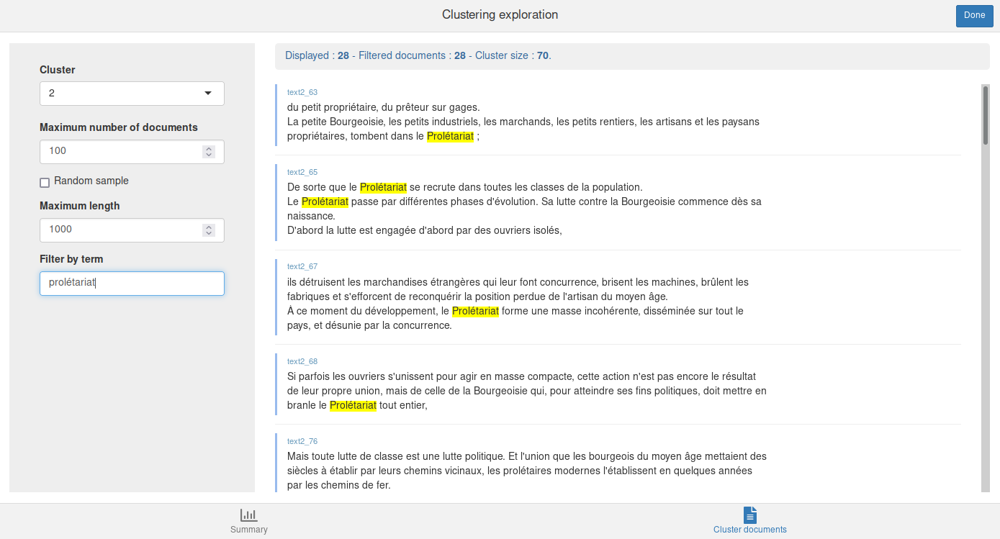
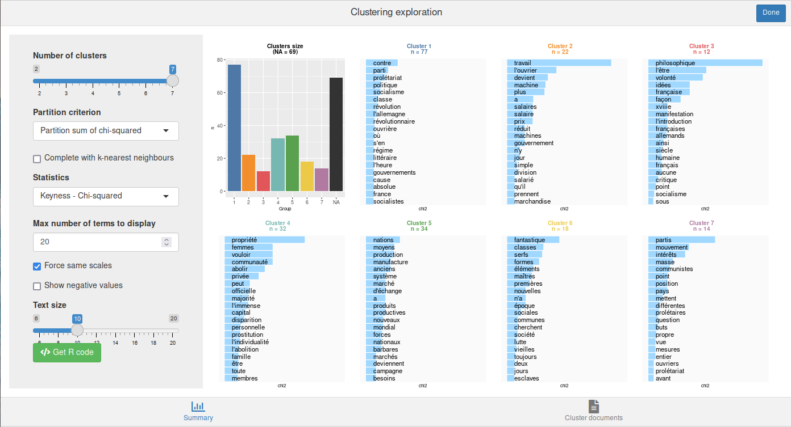

Pour une présentation en français des principes de la méthode et de son utilisation dans `rainette`, vous pouvez aussi consulter la vidéo d'une intervention réalisée dans le cadre d'[un tuto](https://mate-shs.cnrs.fr/actions/tutomate/tuto42-rainette-julien-barnier/) du réseau métier [Mate-shs](https://mate-shs.cnrs.fr/).

<iframe width="560" height="315" src="https://www.youtube.com/embed/T9r8T5WZYHY" title="YouTube video player" frameborder="0" allow="accelerometer; autoplay; clipboard-write; encrypted-media; gyroscope; picture-in-picture" allowfullscreen></iframe>


# Préparation du corpus

## Importation

La première étape consiste à importer votre corpus dans R. Vous pouvez utiliser un corpus au format `tm` ou `quanteda`, ou bien utiliser la fonction `import_corpus_iramuteq` pour importer directement un corpus depuis un fichier texte [au format Iramuteq](http://www.iramuteq.org/documentation/formatage-des-corpus-texte). Dans ce cas vous obtiendrez un objet de type `corpus` du package [quanteda](https://quanteda.io). Les métadonnées éventuelles présentes dans le fichier (*variables étoilées*) sont importées en tant que métadonnées du corpus (variables de `docvars(corpus)`).

Pour ce document, on va importer le texte du *Manifeste du parti communiste* (Karl Marx et Friedrich Engels, 1848, source [wikisource](https://fr.wikisource.org/wiki/Manifeste_du_parti_communiste/Lafargue)). Celui-ci est placé dans un fichier texte au format Iramuteq fourni avec `rainette`. Le corpus est composé de quatre documents, un document par partie de l'ouvrage.

```{r message=FALSE, warning=FALSE}
library(rainette)
library(quanteda)

## Import du corpus
fichier <- system.file("extdata", "manifeste_pc.txt", package = "rainette")
corpus <- import_corpus_iramuteq(fichier)
```

On peut vérifier que notre corpus est bien constitué de quatre documents (l'introduction et les trois parties principales), et d'une variable de métadonnée :

```{r}
corpus
```

Cette variable de métadonnée est justement la partie correspondant au texte :

```{r paged.print=TRUE}
docvars(corpus)
```


## Découpage en segments

La méthode Reinert de classification s'applique à des segments de texte relativement courts, et non à des textes longs. Une première étape consiste donc à découper chaque texte du corpus en segments via la fonction `split_segments()`. Ici on découpe en segments d'environ 40 mots (l'algorithme essaie de tenir compte de la ponctuation pour, par exemple, placer les césures entre des phrases ou au niveau d'une virgule).

```{r message=FALSE}
corpus <- split_segments(corpus, segment_size = 40)
```

Notre corpus est désormais constitué de 278 segments et 2 variables de métadonnées :

```{r}
corpus
```

Si on regarde les nouvelles métadonnées, on peut voir que la variable `partie` a été dupliquée pour chaque segment correspondant, et une nouvelle variable `segment_source` indique le document d'origine du segment.

```{r}
head(docvars(corpus))
```

On peut aussi visualiser les premiers segments de texte calculés :

```{r}
as.character(corpus)[1:2]
```


## Calcul et traitement de la matrice termes-documents

L'étape suivante est de calculer la matrice termes-documents (*dtm*), grand tableau numérique comportant les documents en lignes, les termes en colonnes, et comme valeurs le nombre d'occurrences de chaque terme dans chaque document.

Notre corpus étant au format `quanteda`, on va utiliser les fonctions de cette extension.

On commence par tokeniser le corpus en supprimant nombre et ponctuations, on supprime les mots outils les plus courants et on convertit tous les termes en minuscules, puis on calule la matrice termes-documents avec la fonction `dfm()`.

```{r}
tok <- tokens(corpus, remove_punct = TRUE, remove_numbers = TRUE)
tok <- tokens_remove(tok, stopwords("fr"))
tok <- tokens_tolower(tok)
dtm <- dfm(tok)
```

On supprime ensuite de la matrice les termes apparaissant dans moins de 3 segments.

```{r}
dtm <- dfm_trim(dtm, min_docfreq = 3)
```

De nombreux autres traitements seraient possibles, mais on se contentera de cette matrice pour cet exemple.


# Classification simple

Une fois notre matrice calculée, on peut procéder à une première forme de classification : une classification descendante hiérarchique simple, calculée avec la fonction `rainette()`. 

On peut lui passer plusieurs arguments, notamment :

- `k` : le nombre maximal de classes souhaitées.
- `min_split_members` : le nombre minimal de documents pour qu'une classe soit scindée en deux à l'étape suivante de la classification.
- `min_segment_size` : le nombre minimal de termes par segment. En effet, lors de la tokenisation et du calcul de la dtm, certaines formes (mots-outils, mots trop peu fréquents) ont été supprimées, nos segments peuvent donc varier en taille (entendue comme le nombre de termes encore présents). Avec `min_segment_size = 10`, les segments comportant moins de 10 formes sont regroupés avec le segment suivant ou précédent du même document (si possible) jusqu'à atteindre la taille minimale souhaitée.

```{r message=FALSE}
res <- rainette(dtm, k = 5, min_segment_size = 10, min_split_members = 10)
```

L'objet résultat ne nous dit pas grand chose en lui-même :

```{r}
res
```

Pour faciliter l'exploration des résultats, `rainette` propose une interface interactive qui peut être lancée avec la fonction `rainette_explor()` :

```{r eval = FALSE}
rainette_explor(res, dtm, corpus)
```

L'interface devrait ressembler à quelque chose comme ça :


Il est possible de modifier le nombre de classes, la statistique utilisée dans les graphiques (spécificité, termes les plus fréquents), etc. Par défaut, les graphiques sous chaque classe indiquent les termes les plus caractéristiques du groupe positivement (en bleu) ou négativement (en rouge et si vous avez coché la case *Show negative values*).

Cette interface vous permet d'expérimenter librement sur le nombre de classes et leur interprétation. 

L'onglet *Cluster documents* permet à tout moment de visualiser les documents d'une classe. Vous pouvez également filtrer ces documents en saisissant un mot ou une expression régulière dans le champ *Filter by term* :



Dans l'onglet *Summary*, vous pouvez également cliquer sur *Get R code* pour obtenir le code R correspondant au graphique actuellement affiché, ainsi que la commande `cutree` qui vous permet de récupérer les groupes d'appartenance de chaque document du corpus, là aussi selon le nombre de groupes actuellement affichés.

```{r eval=FALSE}
## Clustering description plot
rainette_plot(res, dtm, k = 5, type = "bar", n_terms = 20, free_scales = FALSE,
    measure = "chi2", show_negative = "TRUE", text_size = 11)
## Groups 
cutree(res, k = 5)
```

Vous pouvez par exemple utiliser l'appel de `cutree` pour ajouter comme nouvelle métadonnée du corpus le groupe d'appartenance de chaque segment pour la classification en 5 classes :

```{r}
corpus$groupe <- cutree(res, k = 5)
head(docvars(corpus))
```

Ici les classes ont attribuées aux segments, et non aux documents dans leur ensemble. La fonction `clusters_by_doc_table()` permet d'afficher, pour chaque document (ici chacune des quatre parties du texte), le nombre de segments de chaque groupe :

```{r}
clusters_by_doc_table(corpus, clust_var = "groupe")
```

En ajoutant `prop = TRUE`, cette répartition peut être visualisée en pourcentages :

```{r}
clusters_by_doc_table(corpus, clust_var = "groupe", prop = TRUE)
```

À l'inverse, `docs_by_cluster_table()` permet de visualiser, pour chaque groupe, le nombre et la proportion de documents d'origine comportant au moins un segment de ce groupe :

```{r}
docs_by_cluster_table(corpus, clust_var = "groupe")
```


# Classification double

Le deuxième type de classification proposé est une classification double : selon la méthode proposée par Max Reinert, on effectue deux classifications simples en faisant varier la taille minimale des segments, puis on "croise" les résultats de ces deux classifications pour déterminer de nouvelles classes, potentiellement plus robustes. Pour plus de détails sur la classifcation double, se référer à la [vignette de description des algorithmes](algorithmes.html).

Une classification double utilise la fonction `rainette2()`. On commence par effectuer les deux classifications simples, ici une avec une taille de segment minimale à 10, et une autre à 15 :

```{r message=FALSE, warning=FALSE}
res1 <- rainette(dtm, k = 7, min_segment_size = 10)
res2 <- rainette(dtm, k = 7, min_segment_size = 15)
```

Puis on utilise `rainette2()` sur ces deux objets résultats, en lui indiquant le nombre maximal de classes à calculer (argument `max_k`).

```{r message=FALSE}
res <- rainette2(res1, res2, max_k = 7)
```

Un paramètre important de `rainette2()` est le paramètre `full` :

- Si `full = TRUE` (valeur par défaut), la sélection des partitions optimales de classes croisées se fait en conservant toutes les classes croisées non nulles. Ceci permet une recherche "exhaustive" et permet de sélectionner les partitions ayant l'effectif total le plus élevé ou bien le χ² d'association le plus fort. Les temps de calcul peuvent cependant être longs si le nombre de classes de départ est important.
- Si `full = FALSE`, seules les classes croisées dont les deux memebres sont les plus associés mutuellement au sens du χ² sont conservées. Les calculs sont beaucoup plus rapides, mais le *k* maximal risque d'être moins élevé, et seules les partitions avec le χ² d'association le plus élevé sont conservées.

À noter que pour `full = TRUE`, si le temps d'exécution est trop long il est possible d'utiliser également `parallel = TRUE` qui permet de paralléliser une partie des calculs (attention cette option ne fonctionne pas sous Windows, et elle utilise davantage de RAM).

Dans tous les cas l'objet résultat contient, pour chaque valeur de `k`, les partitions optimales trouvées et leurs caractéristiques. Là encore, une interface interactive est proposée pour visualiser et explorer ces résultats. Elle se lance via la fonction `rainette2_explor()` :

```{r eval=FALSE}
rainette2_explor(res, dtm, corpus)
```



L'interface est très semblable à la précédente, sauf qu'il n'y a plus de dendrogramme mais à la place un diagramme en barre des effectifs des groupes. Soyez attentifs aux `NA`, qui représentent les segments non classés : contrairement à la classification simple, ils peuvent ici être assez nombreux.

Si certains segments n'ont pas été affecté à un groupe, vous pouvez utiliser `rainette2_complete_groups()` pour les assigner au groupe le plus proche selon une méthode *k-nearest neighbors*  (avec k=1). Ceci n'est cependant pas forcément conseillé car les classes perdont du coup une partie de la "robustesse" acquise par la classification double.

```{r}
groupes <- cutree(res, k = 5)
groupes_complets <- rainette2_complete_groups(dtm, groupes)
```


# Traitements complémentaires

Dans sa version originale, la méthode Reinert de classification est souvent suivie par une analyse complémentaire centrée sur les mots-outils et par différentes représentations graphiques, notamment en projetant les classes obtenues sur des résultats d'analyses factorielles.

On trouvera une explication et un exemple d'application, ainsi qu'un aperçu des fondements théoriques de la méthode dans l'article de Claire Tissot : [Analyse textuelle du roman « Sarrasine » d’Honoré de Balzac : de la recherche de thèmes à la sémiotique](https://fr937137372.wordpress.com/2022/05/06/analyse-textuelle-du-roman-sarrasine-dhonore-de-balzac-de-la-recherche-de-themes-a-la-semiotique/).

